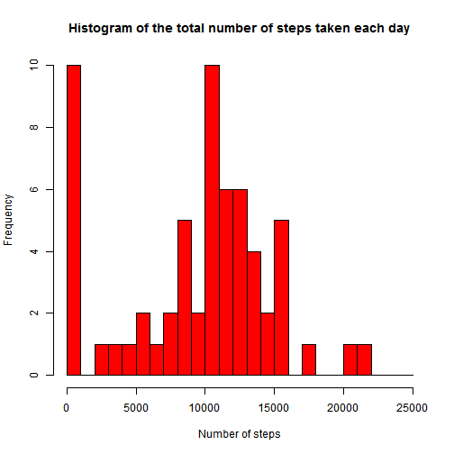
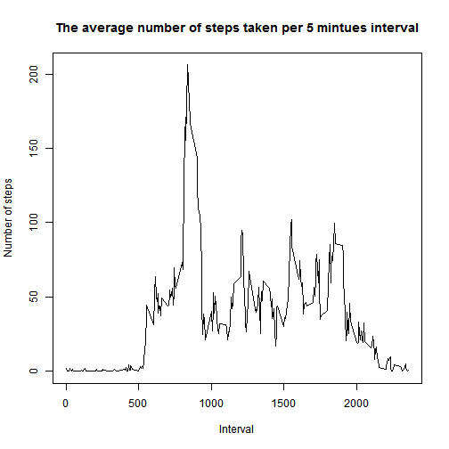
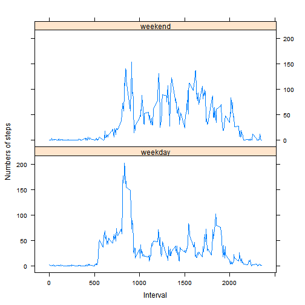

# Reproducible Research: Peer Assessment 1

## Loading and preprocessing the data

This is the code for loading and preprocessing data, default echo = TRUE:

```r
data <- read.csv("activity.csv", colClasses = c("numeric", "character", "numeric"))
list1 <- split(data, data[, 2])  ## split by date
list2 <- split(data, data[, 3])  ## split by interval
```


## What is mean total number of steps taken per day?


```r
sum.steps <- function(df) {
    total <- sum(df$steps, na.rm = TRUE)
}
total.list <- lapply(list1[1:length(list1)], sum.steps)
total.list <- as.numeric(total.list)

days <- names(list1)
hist.data <- data.frame(date = days, totalsteps = total.list, stringsAsFactors = FALSE)

hist(hist.data$totalsteps, breaks = seq(0, 25000, 1000), col = "red", main = "Histogram of the total number of steps taken each day", 
    xlab = "Number of steps")
```

 


```r
mean.total <- mean(total.list)
median.total <- median(total.list)
```

The mean total number of steps taken per day is 9354.2295 steps, and the median total number of steps taken per day is 1.0395 &times; 10<sup>4</sup> steps.


## What is the average daily activity pattern?


```r
interval <- as.integer(names(list2))

mean.interval <- function(df) {
    mean.5min <- mean(df$steps, na.rm = TRUE)
}
mean5min.list <- lapply(list2[1:length(list2)], mean.interval)
mean5min.list <- as.numeric(mean5min.list)

plot(interval, mean5min.list, type = "l", main = "The average number of steps taken per 5 mintues interval", 
    xlab = "Interval", ylab = "Number of steps")
```

 


```r
max.5min <- interval[which(mean5min.list == max(mean5min.list))]
```

The interval at 835 mintues on average across all the days in the dataset, contains the maximum number of steps.

## Imputing missing values

Counting the total number of missing values:

```r
total.cases <- nrow(data)
good <- complete.cases(data$steps)
miss.cases <- total.cases - sum(good)
```

The total number of missing values in the dataset is 2304.

I choose to fill NA with the mean steps of that specific day.

```r
mean.day <- function(df) {
    meanday <- mean(df$steps, na.rm = TRUE)
}
mean.list <- lapply(list1[1:length(list1)], mean.day)
mean.list <- as.numeric(mean.list)
mean.list[is.na(mean.list)] <- 0

data.fill <- data
for (i in 1:nrow(data.fill)) {
    if (is.na(data.fill$steps[i])) {
        NA.Date <- data.fill$date[i]
        j <- which(days == NA.Date)
        data.fill$steps[i] <- mean.list[j]
    }
}
```


```r
list3 <- split(data.fill, data.fill[, 2])

sum.steps <- function(df) {
    total <- sum(df$steps, na.rm = TRUE)
}
total.list1 <- lapply(list3[1:length(list3)], sum.steps)
total.list1 <- as.numeric(total.list1)

hist.data1 <- data.frame(date = days, totalsteps = total.list1, stringsAsFactors = FALSE)
hist(hist.data1$totalsteps, breaks = seq(0, 25000, 1000), col = "red", main = "Histogram of the total number of steps taken each day", 
    xlab = "Number of steps")
```

 

```r

mean.total1 <- mean(total.list1)
if (mean.total1 == mean.total) flagmean = "is not" else flagmean = "is"
median.total1 <- median(total.list1)
if (median.total1 == median.total) flagmedian = "is not" else flagmedian = "is"
```

After filling NAs, the mean total number of steps taken per day is not different, and the median total number of steps taken per day is not different.

## Are there differences in activity patterns between weekdays and weekends?


```r
data.date <- data.fill
data.date$date <- strptime(data.date$date, format = "%Y-%m-%d")
data.date$week <- weekdays(data.date$date)
data.date$level <- data.date$week

for (i in 1:nrow(data.date)) {
    if (data.date$level[i] == "Saturday" | data.date$level[i] == "Sunday") {
        data.date$level[i] <- "weekend"
    } else data.date$level[i] <- "weekday"
}
data.date$level <- as.factor(data.date$level)

weekday.data <- subset(data.date, data.date$level %in% factor("weekday"))
list.weekday <- split(weekday.data, weekday.data[, 3])
mean5min.weekday <- lapply(list.weekday[1:length(list.weekday)], mean.interval)
mean5min.weekday <- as.numeric(mean5min.weekday)

weekend.data <- subset(data.date, data.date$level %in% factor("weekend"))
list.weekend <- split(weekend.data, weekend.data[, 3])
mean5min.weekend <- lapply(list.weekend[1:length(list.weekend)], mean.interval)
mean5min.weekend <- as.numeric(mean5min.weekend)

if (all(mean5min.weekday == mean5min.weekend)) flagdif = "is not" else flagdif = "is"
if (sum(mean5min.weekday) > sum(mean5min.weekend)) flaglevel = "more" else flaglevel = "less"

level1 <- rep("weekday", length(mean5min.weekday))
level2 <- rep("weekend", length(mean5min.weekend))
interval.df <- data.frame(steps = c(mean5min.weekday, mean5min.weekend), interval = c(interval, 
    interval), level = c(level1, level2))
library(lattice)
xyplot(interval.df$steps ~ interval.df$interval | interval.df$level, type = "l", 
    layout = c(1, 2), xlab = "Interval", ylab = "Numbers of steps")
```

 

There is difference in activity patterns between weekdays and weekends. Weekdays are less active than weekends.
